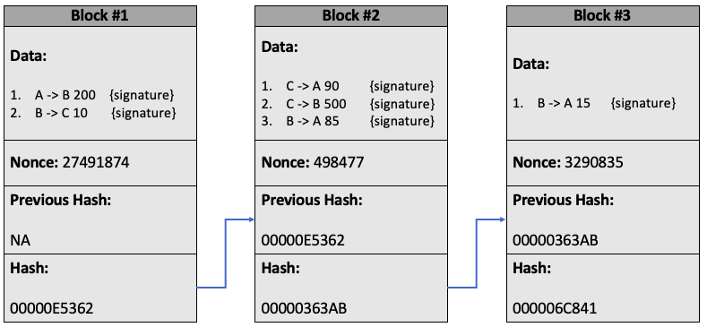

---
date:
  created: 2020-11-26
pin: true
links:
  - Homepage: index.md
categories:
  - Software
tags:
  - cryptography
  - blockchain
  - cryptocurrency
authors:
  - jacob
slug: how-blockchain-works
---

# How Blockchain Works

A few years ago, a friend approached me about starting a smart contract venture. While I hadn't one iota of experience with blockchain, I did have enthusiasm in spades. Sadly, our venture never got beyond the ideation stage. However, I did have a lot of fun learning about blockchain and even managed to create my very own cryptocurrency I christened STRAUSS COIN.

I wrote this post to cement what I learned, and to provide a layperson summary on what has become one of the most important ideas of the 21st century: blockchain.
<!-- more -->

## A Ledger Amongst Friends

Suppose that you and some friends frequently exchange money, and that rather than going to the effort of physically exchanging cash every time you do so, you decide to create a *ledger*. This ledger is a record of financial transactions between people, and now at the end of the month if you spent more than you received you pay in what you spent, and if you received more than you spent you simply collect what others pay in. If everyone is allowed to add lines to the ledger, then you and all of your friends are able to quickly and efficiently send and receive money. 

| Sender   | Receiver  | Amount |
|----------|-----------|--------|
| Alice    | Bob       | £200   |
| Bob      | Charlie   | £150   |
| Charlie  | Alice     | £500   |
| Charlie  | Bob       | £75    |

## Digital Signatures

Unfortunately, there is a problem with this system. By allowing everyone to add lines to the ledger there is nothing stopping someone from adding a fraudulent transaction. What we need is some form of verification that the sender and receiver of cash both agree on the transaction. This is where our first bit of cryptographic security enters the foray: *digital signatures*. If the ledger was written on a piece of paper, we could have the sender and receiver agree on a transaction by signing the line on the ledger on which the details of that transaction were written. However, things on a computer work a little differently (and more securely). Every person in the network has a **secret key** (SK) and a **public key** (PK). Both of these are a unique string of random ones and zeros, and like the names suggest the SK is kept a secret, whereas the PK is made publicly available. Now, in order to sign a transaction, a person takes the data of that transaction and combines it with their secret key to produce a signature. A function that does this might look a little something like:

`Sign(Message, SK) = Signature`

What this means is that each signature is dependent on the message that the user is signing. This is great because now there is no way anyone could somehow copy your signature. Suppose for example that we have “Alice pays Bob £200” written on the ledger. The digital signature Alice uses for this transaction is cryptographically linked to the message, meaning that “Alice pays Bob £300” will produce a completely different, though equally valid signature!

| Ledger                   | Signed           |
|--------------------------|------------------|
| Alice pays Bob £200      | 73289EA2791AFB3  |
| Bob pays Charlie £150    | 378259FE11B23A2  |
| Charlie pays Alice £500  | A4382A237AE29BB  |
| Charlie pays Bob £75     | 6CCC2819E91BA01  |

Now this is good, but at the moment only the two people involved in this transaction can verify that they have accepted it (since they don’t reveal their SK). What we now need is some function that will take in a transaction, a signature and some identifier that verifies that the signature indeed does come from the people involved in the transaction. This is where the PK comes in. The PK is a unique number given to each person and is publicly available for everyone to see. As a result, anyone could use this PK to verify that a transaction was accepted by all of those involved. The function would look a little something like:

`Verify(Message, Signature, PK) = True / False`

This function will return `true` if the signature was produced by the SK associated with the PK, and will otherwise return `false`.

Splendid, so we have a ledger, and we have a secure way of adding transactions to the ledger. Job done. Well, not quite... Where even is this ledger being stored? Who is keeping this ledger secure? We can add transactions, but what if someone were to secretly change or remove a transaction? This was the problem originally stated in the first Bitcoin paper and its solution is what makes blockchain so powerful. However, before I delve into the specifics of how we use blockchain to solve this problem, I first need to talk about the SHA256 algorithm.

## SHA256

SHA256 (short for Secure Hashing 256) is function that takes in any data of any length and returns a 64-character hexadecimal number. The reason it’s called 256 is because it always returns something that is 256 bits in memory. SHA256 function is such that you can input anything of any size – images, videos, operating systems, etc – and it will return a 64-character hash. If you want to see this for yourself, (this webpage)[https://tools.superdatascience.com/blockchain/hash/] that will encode anything you enter using SHA256. It doesn’t matter what you enter, whether it is a single number or the entire works of William Shakespeare, the function will only ever return a 64-character output. 

There are a few additional requirements for any hashing algorithm (SHA256 is just one of them), which are that they need to be:

1. **Deterministic:** an input always produces the same output.
2. **One-way:** given an input you can calculate its corresponding hash, but you can’t calculate an input from a given hash (you can’t reverse engineer the algorithm).
3. Able to **calculate hashes quickly**.
4. Obey the **Avalanche Effect**: small changes in the input produce wildly different hashes.

There are loads more, but in the interest of time I only wish to address these four. With respect to the avalanche effect, definitely try it out using the link above. Try giving in some long input, such as the entire text to Tolstoy’s War and Peace, and see just look how quickly it generates a hash. Then change a single character, maybe add an extra space, or capitalise a letter, notice how making this small change completely alters the hash. However, when we revert back to the original input the hash returns to its original value. Incredible!

A lot of internet security is predicated on the security of SHA256. In fact, most of our online banking is only made possible because of this hashing algorithm. Remember earlier when we were talking about digital signatures? That is an implementation of SHA256! Our functions takes in our data and SK, combine them, and then runs them through the SHA256 algorithm; and since SHA256 is one-way, there is no good way anyone could find out your SK. The only way they could ever do this is by randomly guessing your SK, then checking whether this matches the output generated by SHA256. 

## P2P Network

Ok, that was SHA256, now back to our problem: how can we decentralise our communal ledger? What we could do is have everyone in our network keep a copy of the ledger – this is known as a peer-to-peer network (P2P). This isn’t a bad start, but we quickly run into some problems. If you are broadcasting your transactions, how can you be sure that everyone else is recording them on their ledger? How could you ensure that everyone in the network finds a consensus on what is on the ledger, and what is not on the ledger? There are different solutions to this problem, though the two most popular are the “proof-of-work” protocol and the “proof-of-stake” protocol. In this post, I will only talk about proof-of-work since this is the original protocol that Bitcoin introduced. 

## Proof-of-Work and the Nonce

Suppose I had the following ledger:

| Sender   | Receiver  | Amount | Signed           |
|----------|-----------|--------|------------------|
| Alice    | Bob       | £200   | 73289EA2791AFB3  |
| Bob      | Charlie   | £150   | 378259FE11B23A2  |
| Charlie  | Alice     | £500   | A4382A237AE29BB  |
| Charlie  | Bob       | £75    | 6CCC2819E91BA01  |
**Hash:** `40A025FF8B22830D92`*

A signed ledger with its corresponding hash value after inputting it in the SHA256 algorithm. * This would normally be 64 digits

What I could do is take this entire ledger and run it through my SHA256 algorithm. This would give me some hash value: let’s say it returns 40A025FF8B22830D92 (in reality it would be 64 digits long). Now if I add some arbitrary value to this ledger (called a nonce), say the number 421341, so that SHA256 returns a hash value with four leading zeros, e.g. 00005435A8BF2830DA, how hard do you think it was for me to find this number? 

| Ledger                   | Signed           |
|--------------------------|------------------|
| Alice pays Bob £200      | 73289EA2791AFB3  |
| Bob pays Charlie £150    | 378259FE11B23A2  |
| Charlie pays Alice £500  | A4382A237AE29BB  |
| Charlie pays Bob £75     | 6CCC2819E91BA01  |
**Nonce:** `421341`
**Hash:** `00005435A8BF2830DA`

A signed ledger with an attached nonce, such that when inputting the ledger together with the nonce into a SHA256 function its output hash will have a certain number of leading zeros.

Since there is no way for me to reverse engineer SHA256 I would have to randomly guess which number would produce such an outcome. The probability of finding such a number is ridiculously small – for Bitcoin it in the region north of one in a 100 billion. I will have done an incredible amount of computational work to find this number, but you can easily check whether or not this number combined with the above ledger produces a hash with four leading zeros. This number is called a “nonce” and this protocol is called a “proof of work”. Importantly, the nonce is intrinsically tied to the ledger – just like the signature was intrinsically tied to the transaction – meaning that if you change what is written on the ledger, the hash associated with the ledger is very unlikely to start with four leading zeros, and you would have to go through all that work again to find a new nonce. This is what “miners” do: they find nonces – but more on that later.

Now think back to our original distributed ledger. Everyone is broadcasting transactions, writing down what they received on their ledger and comparing their ledger with everyone else’s. Whose do we trust to be the correct one? Answer: the one with the most computational work put in!

## Blockchain

Some 1500 words later we have finally at what blockchain is. The way this proof of work concept works is as follows. We organise the ledger into blocks, where each block consists of a list of data (in this case transactions) together with a nonce, so that the hash of the block starts with a certain number of zeros (five in the example below). The hash of each block must start with a certain number of zeros, and we only acknowledge blocks that do. To ensure that there is a standard order to these transactions, we also include the hash of the previous block. This value of the previous hash is incorporated in with the calculation of our current hash and so changing any block in the chain will cause all proceeding blocks to become invalid. 

An example of a blockchain. Called such because we chain a bunch of blocks together.

To summarise, each block consists of:

1. **A block number**: to ensure there are no duplicate blocks.
2. **The signed data**: to ensure that each transaction is valid.
3. **The nonce**: a number that when added to the block makes the hash of that block have a certain number of leading zeros.
4. **The previous hash**: the value of the hash of the previous block.
5. **The current hash**: the value of the hash created by running the above four items through SHA256.

The hash of each block can be thought of its fingerprint. It is a unique value dependent on all of the information written in the block and changing any of the block’s information changes the block’s hash.

## An Immutable Ledger

To see why this system is so secure, let’s say a hacker tries to change one of the transactions in Block #2. Due to the avalanche effect, the slightest change in the block yields a different hash. This means they would also have to go through all the computational work of finding a new nonce. However, now the following block is invalid as well, since its hash was creating using the previous hash, meaning the hacker will have to find a new nonce for the following block as well, and so on. All the while, you are checking to see that your blockchain is the same as everyone else’s in the network, and when you notice that your blockchain is different, you can revert back to the one everyone else has. 

## Miners

Okay, to recap we have a secure way to agree on transactions, we have a secure way of storing a communal ledger and we have it such that existing transactions cannot be changed. The very last problem we need to solve is how to add new blocks to the chain.

This is where miners come in. In our current set up the miners are listening out for transactions and adding them to their copy of the ledger. When they find a nonce for a given set of transactions, they broadcast it across the network, and everyone checks that the new block fits in with their existing chain. The miner will then be rewarded for the work they put into finding new blocks with some amount of money – this is either a fixed amount (like £10 for each block) or something like a transaction fee (from each transaction on the block the miner gets 5p). Everyone else just using the network simply listens for these blocks and updates their chain. 

## Conflicting blocks

Sometimes two miners will broadcast conflicting blocks. Perhaps before broadcasting the block, one of the miners added a line saying that Bob owes them 200 coins. Which is the correct one? Remember that in our P2P network we trust the chain with the most work put into it, so we just wait until we hear an additional block and whichever chain it tacks onto is the valid one. Finding new blocks takes a lot of work, hence if we have one malevolent miner versus ten honest ones trying to find the next block chances are that good will prevail. Of course, we don’t immediately trust any block sent to us, we instead wait until four or five proceeding blocks are sent before trusting it. Now there is an interesting problem in mathematics called the Byzantine General Problem that analogously asks how many trustworthy miners are required for the blockchain to be robust, but I think that is for another blog post.